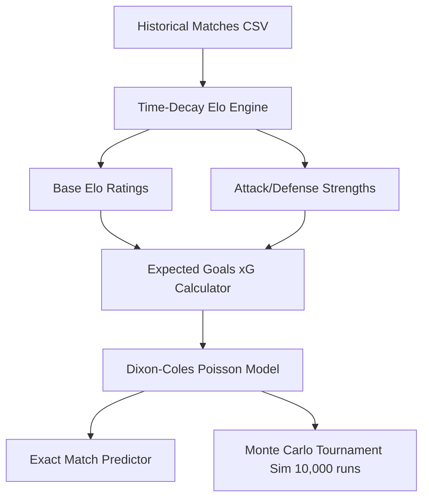

# FIFA World Cup 2026 Prediction Model Methodology

This document provides a detailed overview of the mathematical models, parameter choices, data sources, assumptions, and limitations of the World Cup Oracle prediction engine.

> [!IMPORTANT]
> **Disclaimer on Betting and Accuracy**
> The predictions, expected goals (xG), match outcome probabilities, and tournament simulation results generated by this tool are for informational, educational, and entertainment purposes only. They do not constitute financial advice, investment advice, or official betting odds. The engine does not promise or guarantee unmeasured accuracy, and real-world outcomes will vary due to the inherent unpredictability of sports.

---

## 1. Data Provenance & Structure

The prediction engine relies on two primary datasets:

1. **Historical Matches Dataset**: 
   - Sourced from Mart J. Van de Guchte's international football results repository.
   - Contains ~49,000 historical international football matches recorded since 1872.
   - **Retrieval Mechanism**: The system fetches the dataset from GitHub (`https://raw.githubusercontent.com/martj42/international_results/master/results.csv`) on startup. If the network request fails, it falls back to a verified local snapshot at [international-results.snapshot.csv](file:///Users/agus/Developer/world-cup-prediction/artifacts/api-server/src/data/international-results.snapshot.csv).
2. **FIFA World Cup 2026 Structure**:
   - Sourced and transcribed from FIFA's official "FIFA World Cup 2026 Match Schedule" PDF (published June 28, 2026).
   - Contains the 48 qualified teams, 12 groups (A through L), and scheduled group fixtures.
   - Stored locally at [fifa-world-cup-2026.v1.json](file:///Users/agus/Developer/world-cup-prediction/artifacts/api-server/src/data/fifa-world-cup-2026.v1.json).

---

## 2. Mathematical Model Components



### A. Time-Decay Elo Engine
The engine computes team strength dynamically by updating Elo ratings chronologically across the entire historical match dataset.

#### 1. Expected Score Formulation
For a match between Team $A$ (with rating $R_A$) and Team $B$ (with rating $R_B$), the expected score $E_A$ for Team $A$ is:
$$E_A = \frac{1}{1 + 10^{(R_B - R_A) / 400}}$$
$$E_B = 1 - E_A$$

#### 2. K-Factor & Recency Weighting
The weight of a match (its K-factor) is scaled by the importance of the tournament and exponentially decayed based on how many years ago the match occurred relative to the reference year ($t$):
$$K_{\text{effective}} = K_{\text{tournament}} \times \max\left(0.05, e^{-0.055 \times t}\right)$$

This exponential decay represents a **half-life of approximately 12.6 years** ($\ln(2) / 0.055 \approx 12.6$), ensuring modern match results carry substantially more weight than historical ones.

The baseline $K_{\text{tournament}}$ values are:
* **World Cup Finals**: 60
* **Continental Cup Finals** (Euro, Copa América, Gold Cup, Africa Cup of Nations, AFC Asian Cup, CONCACAF Nations League Finals): 50
* **World Cup / Continental Qualifiers**: 40
* **Nations League Group Stage**: 35
* **Friendlies & Others**: 20

#### 3. Goal Difference Multiplier
To prevent ratings from being overly distorted by extreme scorelines while still rewarding dominant wins, updates scale by a goal difference multiplier ($GD_{\text{mult}}$):
* $GD \le 1$: $GD_{\text{mult}} = 1.0$
* $GD = 2$: $GD_{\text{mult}} = 1.5$
* $GD \ge 3$: $GD_{\text{mult}} = \frac{3 + \frac{GD - 2}{2}}{4}$

#### 4. Rating Update
Ratings are updated after each match:
$$R'_A = R_A + K_{\text{effective}} \times GD_{\text{mult}} \times (S_A - E_A)$$
Where $S_A$ is the actual outcome (1 for a win, 0.5 for a draw, 0 for a loss).

---

### B. Attack & Defense Strength Metrics
Base Elo ratings measure overall team strength but do not capture team-specific tactical traits, such as high-scoring attacks or stingy defenses. The engine computes separate attack and defense strength multipliers:

1. **Rolling Window**: Matches are analyzed over an 8-year recent window.
2. **Opponent Adjustment**: Scored and conceded goals are adjusted by the opponent's Elo strength factor at match time:
   $$\text{Strength Factor} = 10^{(Elo - 1500) / 600}$$
   Goals scored against a strong defense are worth more; goals conceded against a weak attack are penalized more heavily.
3. **Competition Weight**: Matches are weighted based on tournament K-factor.
4. **Shrinkage & Blending**: To account for small sample sizes, recent goal averages are shrunk toward a team's base Elo rating factor using a prior weight of 12 and a maximum blend factor of 0.35:
   $$\text{Attack Strength} = \text{Attack}_{\text{Form}} \times 0.35 + \text{Elo}_{\text{Factor}} \times 0.65$$
5. **Clamping**: To ensure numerical stability, attack and defense multipliers are clamped to $[0.6, 1.5]$.

---

### C. Expected Goals (xG) Calculation
Before modeling goals, the ratings of the two teams are adjusted for home/host status, resulting in $Elo_A$ and $Elo_B$.

The baseline Expected Goals (xG) for a match uses a baseline of 1.25 goals per team (2.50 total goals):
$$diff = \frac{Elo_A - Elo_B}{400}$$
$$ratio = \min\left(6.5, \max\left(0.15, \sqrt{10^{diff}}\right)\right)$$
$$xG_{\text{base, A}} = \frac{2.50 \times ratio}{1 + ratio}$$
$$xG_{\text{base, B}} = 2.50 - xG_{\text{base, A}}$$

These baselines are then multiplied by the respective team strength multipliers:
$$xG_A = xG_{\text{base, A}} \times \text{Attack}_A \times \text{Defense}_B$$
$$xG_B = xG_{\text{base, B}} \times \text{Attack}_B \times \text{Defense}_A$$
A floor of 0.05 expected goals is applied to both teams.

---

### D. Dixon-Coles Poisson Model
Goals are assumed to follow a Poisson distribution, but independent Poisson distributions tend to underestimate the frequency of low-scoring draws (such as 0-0 and 1-1). 

To correct this, the engine applies the **Dixon-Coles adjustment** using a parameter $\rho = -0.06$. The adjustment factor $\tau(x, y)$ for scoreline $(x, y)$ is:
* $\tau(0, 0) = 1.0 - (xG_A \times xG_B \times \rho)$
* $\tau(1, 0) = 1.0 + (xG_B \times \rho)$
* $\tau(0, 1) = 1.0 + (xG_A \times \rho)$
* $\tau(1, 1) = 1.0 - \rho$
* For any other scoreline, $\tau(x, y) = 1.0$

The probability of scoreline $(x, y)$ is then computed as:
$$P(X=x, Y=y) = \tau(x, y) \times \frac{e^{-xG_A} xG_A^x}{x!} \times \frac{e^{-xG_B} xG_B^y}{y!}$$

During simulations, goals are drawn from these distributions using rejection sampling. For exact head-to-head match predictions, a truncated grid up to 10 goals is constructed, adjusted via Dixon-Coles, and normalized.

---

### E. Home & Host Advantage
* **Regular Home Matches**: The home team receives a boost of $+75$ Elo.
* **World Cup 2026 Host Boost**: The host nations (USA, Mexico, and Canada) receive a boost of $+50$ Elo when playing in their country.
  - **Group Stage, Round of 32, and Round of 16**: Applied to hosts playing in their country.
  - **Quarter-Finals onwards**: Since all matches from the QFs onward are hosted in the United States, only the USA qualifies for the host boost.
  - **Host vs. Host Matches**: If two host nations meet in a round where both would have host status, the match is treated as neutral, and neither receives a boost.

---

## 3. Monte Carlo Tournament Simulation
The tournament champion and knockout probabilities are calculated via **10,000 Monte Carlo runs**:

1. **Group Stage**:
   - Each group match is simulated using the Dixon-Coles Poisson model.
   - Standings are ranked by points (3 for a win, 1 for a draw).
   - Tiebreakers are modeled in accordance with the FIFA 2026 format: points; head-to-head points, head-to-head goal difference, and head-to-head goals scored; overall goal difference; overall goals scored. If still tied, a seeded random fallback is used.
2. **Third-Place Comparison**:
   - The third-place teams across all 12 groups are ranked on a separate table using points, overall goal difference, and overall goals scored.
   - The top 8 third-place teams advance to the Round of 32.
3. **Knockout Stage**:
   - Single-elimination matches.
   - If a knockout match ends in a draw after regulation time, a penalty shootout is simulated with a 50/50 probability of advancing for each team.

### Simulation Uncertainty
Tournament probabilities are estimates from a finite number of Monte Carlo runs, not exact truths. For each displayed event probability \(p\), the API reports binomial Monte Carlo uncertainty:

$$SE = \sqrt{\frac{p(1-p)}{n}}$$

Where \(n\) is the number of simulation runs. The approximate 95% confidence interval is:

$$p \pm 1.96 \times SE$$

With 10,000 runs, the largest possible standard error occurs around a 50% probability and is about 0.5 percentage points, or roughly +/-1.0 percentage point for a 95% interval. Smaller and larger probabilities usually have narrower Monte Carlo intervals. These intervals describe simulation sampling error only; they do not include model uncertainty from Elo parameters, team news, injuries, tactics, or tournament assumptions.

In the leaderboard, tiny differences inside the Monte Carlo interval should be treated as statistical ties rather than absolute ranking truth.

---

## 4. Verification & Model Backtesting

The predictive power of the model is measured using rolling-origin historical backtests. Developers and users can run these backtests to verify the model's performance:

```bash
pnpm backtest
```

### Backtest Implementation Details
- The backtest trains Elo ratings on matches before a start date (e.g., `2024-01-01`) and tests predictions on a subsequent window (e.g., `2024-01-01` to `2024-12-31`).
- Ratings are updated in a rolling-origin fashion: each match is predicted *before* its outcome is used to update the ratings for subsequent matches.
- The evaluation compiles:
  - **Brier Score (Multiclass)**: Measures the accuracy of probability forecasts across home win, draw, and away win. Lower is better (0 is perfect, uniform baseline is $\approx 0.222$).
  - **Log Loss**: Penalizes confident incorrect predictions. Lower is better.
  - **Accuracy**: The percentage of matches where the predicted outcome matched the actual result.
  - **Calibration Buckets**: Measures whether predictions expected to occur $X\%$ of the time actually happen $X\%$ of the time.
- **Baseline Comparison**: The model is compared against three baselines:
  1. *Legacy Strength Model*: Expected goals computed without opponent Elo ratings adjustment.
  2. *Elo-only Baseline*: Simple Elo expected scores without Poisson/Dixon-Coles goals or attack/defense strengths.
  3. *Uniform Baseline*: A constant $33.3\%$ probability assigned to all three outcomes.

---

## 5. Model Limitations & Undermeasured Accuracy

While the engine leverages statistical models, users must be aware of significant limitations:

- **No Squad Information**: The model has no access to rosters, player injuries, card suspensions, current player form, transfers, or coaching changes.
- **No Real-time Context**: Pitch conditions, weather, tactical adjustments, team fatigue, travel distances, and motivational variables (e.g., resting players in the third group stage match) are not modeled.
- **Historical Constraints**: Elo ratings require a continuous history of matches. Teams with fewer matches or those playing in weaker confederations may have ratings that do not fully reflect their true relative strength due to limited cross-confederation play.
- **Mathematical Simplifications**: Penalty shootouts are simulated as a simple 50/50 coin flip, ignoring historical shootout success rates or individual goalkeeper/taker skill.
- **Parameter Uncertainty**: Variables like `HOST_BOOST = 50`, `HOME_ADVANTAGE_ELO = 75`, and `DIXON_COLES_RHO = -0.06` are empirical approximations and carry statistical margins of error.
